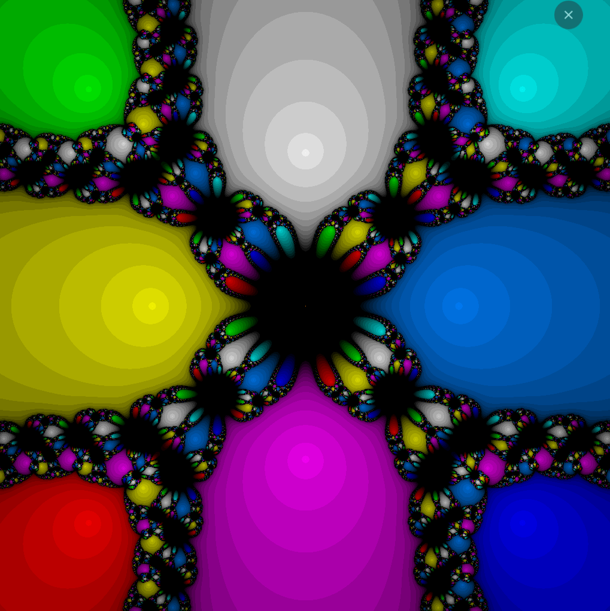

### Newton Fractal Generator 
You can try it online here.

##### Example roots collections
`(1,0); (-0.5,0.86602); (-0.5,-0.86602)`

`(0, 0); (0,1); (1,0); (1,1)`

`(-1.4142,1.4142); (-1.4142,-1.4142); (1.4142,1.4142); (1.4142,-1.4142); (-1.0000,0.0000); (0.0000,1.0000); (0.0000,-1.0000); (1.0000,0.0000)`
